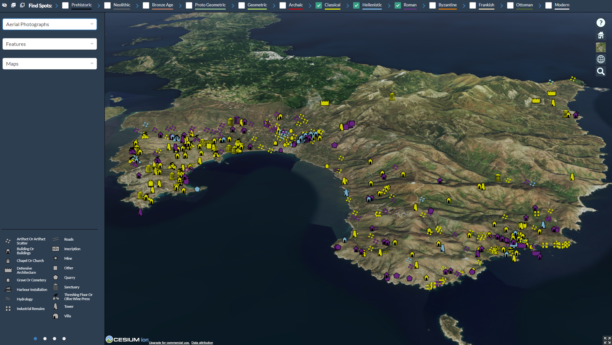

# SESLR Hub

The ‘Sea and Land Routes of southern Euboia’ (SESLR) project aims to provide a detailed study of regional developments in interconnectivity between ca. 4000 and 1 BC and in this manner make a critical contribution to the present discussion about Mediterranean interconnectivity. An important basis for this research has been the creation of a data base of all known settlements, important roads and routes, and maritime infrastructural elements, supplemented with new data provided by fresh field surveys and remote sensing research. From the beginning the intention was to make the project’s data base accessible to a larger group of potential users, including planners, heritage policymakers and archaeologists working for the state archaeological service. This Knowledge Hub is the result of this effort.



## Prerequisites

- docker

## Setup

### reverse proxy

Create a `.htpasswd` file using a password file creation utility, such as apache2-utils or httpd-tools. Place in `./reverseproxy/`.

### web

Create a `./data` folder containing:

- `tms/`
- `features/`
- `terrain/`
- `pictures/`
- `demo/`

and corresponding data.

### database

Create `./database/postgres.env` and fill in user, password and database as shown in the -TEMPLATE file

Create a `./pgdata` folder

### SDI

Use docker-compose to set everything up

```bash
docker-compose up
```
